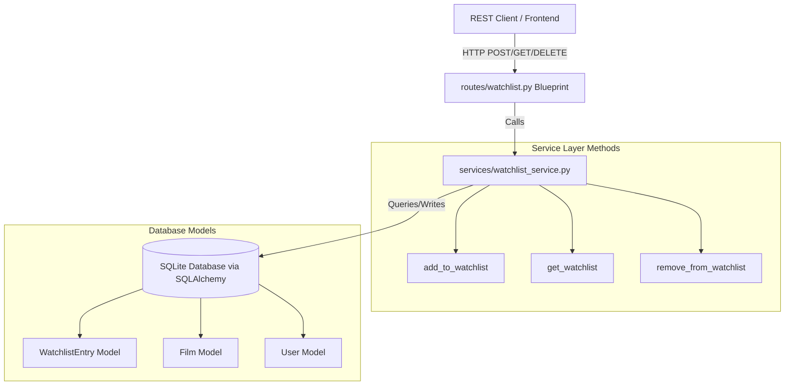

# ARCHITECTURE.md — CineLog Watchlist Feature Architectural Design

This document describes the architectural layout and thin data pipe for the CineLog Watchlist feature.

## System Architecture Overview

The CineLog Watchlist feature is built as a highly decoupled vertical slice matching the existing design patterns of the CineLog application. It spans from the SQLite database representation through the Service (Business Logic) Layer up to the Flask REST API Blueprint layer.

### Thin Pipe Data Flows

#### 1. Add to Watchlist Flow
1. **Client** issues `POST /watchlist/<user_id>/add` with JSON payload `{"film_id": "<uuid>", "public": false}`.
2. **Router Blueprint** (`routes/watchlist/watchlist.py`) validates request payload structure.
3. **Service Layer** (`services/watchlist_service.py:add_to_watchlist`) is called.
   - Fetches the `Film` using `db.session.get`. Raises `FilmNotFoundError` if missing.
   - Queries `WatchlistEntry` to check for duplicates. Raises `AlreadyInWatchlistError` if found.
   - Creates and commits a new `WatchlistEntry`.
4. **Router** catches errors or returns `201 Created` with serialized `WatchlistEntry` dictionary representation.

#### 2. Get Watchlist Flow
1. **Client** issues `GET /watchlist/<user_id>`.
2. **Router Blueprint** calls `services/watchlist_service.py:get_watchlist`.
3. **Service Layer** joins `WatchlistEntry` and `Film`, filters by `user_id`, and orders entries by `date_added` descending (Newest First).
4. **Router** returns list of films with watchlist metadata serialized to JSON.

#### 3. Remove from Watchlist Flow
1. **Client** issues `DELETE /watchlist/<user_id>/remove` with JSON payload `{"film_id": "<uuid>"}`.
2. **Router Blueprint** calls `services/watchlist_service.py:remove_from_watchlist`.
3. **Service Layer** checks if the `WatchlistEntry` exists. If not, raises `NotInWatchlistError`. If it does, deletes and commits changes.
4. **Router** returns success payload or `404 Not Found` error.

---

## Design Choices (Design It Twice)

Regarding Watchlist Entry deduplication, we analyzed two potential interface designs:

### Design Option A: Safe & Raising Exception (Chosen)
- **Signature:** `add_to_watchlist(user_id, film_id, public=False)`
- **Behavior:** Explicitly checks for an existing record. If it exists, raises `AlreadyInWatchlistError`.
- **Pros:** Extremely explicit; aligns with `add_to_collection()`; allows API blueprint to return structured `409 Conflict` response to client.
- **Cons:** Callers must wrap the call in a `try/except` block to prevent internal server error.

### Design Option B: Idempotent & Silently Succeeding
- **Signature:** `add_to_watchlist_idempotent(user_id, film_id, public=False)`
- **Behavior:** Checks for an existing record. If it exists, returns the existing record without throwing.
- **Pros:** Simpler caller usage for batch additions; prevents excessive exceptions.
- **Cons:** Hides state conflict information from API consumers who might want to know whether an item was newly added or already there.

We selected **Design Option A** to preserve exact consistency with `add_to_collection()`.

---

## Vertical Slices (Tracer Bullets)

The implementation is broken into the following complete vertical slices:

### Slice 1: Rename & Clean (Comment 1)
- **Files:** `services/watchlist_service.py`, `routes/watchlist/watchlist.py`
- **Scope:** Rename `save_to_watchlist` to `add_to_watchlist`. Ensure all endpoints compile.

### Slice 2: Service Deduplication (Comment 2 & Stretch Features)
- **Files:** `services/watchlist_service.py`
- **Scope:** Define `AlreadyInWatchlistError`, `NotInWatchlistError`. Update `add_to_watchlist` and add `remove_from_watchlist` implementation with robust validation.

### Slice 3: Endpoint Routing (Stretch Features)
- **Files:** `routes/watchlist/watchlist.py`
- **Scope:** Enable visibility toggle (`public` argument) in POST route, and build the DELETE route for `remove_from_watchlist` with full exception catching.

### Slice 4: Unit & Integration Testing (Comment 3 & Stretch Tests)
- **Files:** `tests/test_watchlist.py`
- **Scope:** Add test cases for nonexistent film ID, sort order (Newest First), and duplicate watchlist prevention.
